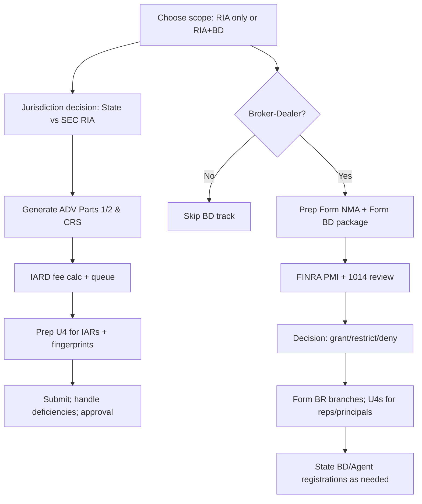

# Codex 73 — Registration Workflow Spine

**Fingerprint:** `291cba39fd206b28e195046ec214b2ef53fe709ce083f20a2173139b47e210a2`

## 2.0 Scope & Principles
- **Single source of truth** for filings, fee clocks, and acceptance dates (IARD/CRD, SEC/State, FINRA).
- **Human-in-the-loop** before every transmission; automation drafts, humans attest.
- **Immutable evidence** (WORM) across drafts, submissions, receipts, and deficiency correspondence.
- **Escalation** on deficiency letters, 30-/45-day timers, or statutory-disqualification flags.

---

## 2.1 Sub-Modules

### 2.1.1 RIA Registration (State or SEC)
**Inputs**
- Entity profile (legal name, jurisdiction, ownership, addresses).
- AUM forecast + client footprint (routes **state** vs **SEC** registration).
- Supervisory roster; **IAR** roster with U4 data; disciplinary history.
- Compliance documents (Code of Ethics, Policies & Procedures, Privacy, BCP, etc.).

**Processes**
1. **Jurisdiction routing:** decide **state** vs **SEC** and which states require firm & IAR registration (IARD decision tree).
2. **Generate Form ADV drafts:**
   - **Part 1** (firm facts, ownership, control persons, business lines).
   - **Part 2A/2B** (plain-English brochures + IAR supplements).
3. **IARD submissions:** queue fees, create filing package, gate final submission on human attestation.
4. **U4 for each IAR:** prefill personal history, exams, fingerprints, disclosures; flag statutory disqualifiers and auto-escalate.
5. **Deficiency handling loop:** parse regulator comments, assign tasks, track 30/45-day clocks, resubmit.
6. **Post-effective tasks:** brochure delivery, books & records, signage, Form CRS, advisory agreements, fee billing rules.

**Outputs**
- IARD receipts (ADV filings), submitted PDFs, fee confirmations, approval/effective notices.
- A dated, immutable **Registration Evidence Bundle**.

---

### 2.1.2 Broker-Dealer (BD) Registration (FINRA + SEC + States)
**Inputs**
- Entity + capital plan, **business lines**, clearing arrangement, **supervisory system/WSPs**, **two principals** minimum (unless sole prop), org chart, financials.
- Locations needing **Form BR** (OSJ/non-OSJ branches), registered persons roster (U4s).

**Processes**
1. **Membership application flow (Form NMA + Form BD)** via FINRA Gateway; collect **Rule 1014** exhibits (business plan, financials, supervision, tech, clearing, training plan) and queue for **Pre-Membership Interview (PMI)**.
2. **Personnel filings:** prepare U4, fingerprints, background checks; auto-flag statutory disqualification risks; prep **MC-400** if sponsoring an SD individual.
3. **Branches:** prepare **Form BR** for each location; mark OSJ vs non-OSJ; ensure resident principal at OSJ; enforce 30-day notice on open/relocate/close.
4. **Registration sequencing:**
   - SEC BD registration (**Form BD**; SEC has **45 days** to accept/deny).
   - FINRA membership decision after PMI (grant / grant with restrictions / deny).
   - State BD + agent registrations as required.
5. **Membership Agreement / Restrictions:** capture permitted activities and restriction tracking (future CMA removals).
6. **Continuing obligations:** designate Executive Representative; Rule 8210 readiness (document production + encryption); schedule net capital / fidelity bond monitoring and CE (reg + firm elements).

**Outputs**
- Approved **Form BD**, FINRA Membership Agreement, branch registrations, individual registrations, WSP attestation trail.

---

### 2.1.3 Individuals: U4 / U5 / Amendments
- **U4 Intake:** identity, 10-year employment, 5-year residence, disciplinary history, fingerprints; verify last 3-year employment & character; manual signatures; **30-day** general amendment rule; **10-day** for SD-related updates.
- **Fingerprints:** submit promptly; “inactive-prints” status if not received in **30 days**; three illegible rejections → exemption; retain 3 years post-termination.
- **U5:** file within **30 days** of termination; provide copy to rep; amend upon new facts; onboarding firm must obtain prior U5 within **60 days** of U4 filing.
- **CE:** Regulatory Element deadlines with inactive status trigger on misses; Firm Element plan & attestations tracked.

---

## 2.2 Workflow Graph (RIA + BD)


---

## 2.3 Guardrails & Escalations
- **Statutory Disqualification Screening:** auto-scan U4 data for felony/financial-dishonesty misdemeanors (10 years), injunctions, expulsions; block submission; propose **MC-400** path if sponsorship pursued.
- **Deadline Bots:**
  - Form U5 within **30 days** of termination.
  - U4 amendments: **30 days** (or **10** for SD issues).
  - SEC Form BD decision SLA **45 days**; branch updates **30 days**; archive all proofs.
- **Two-principal rule:** prevent BD submission until two qualified principals confirmed (unless sole prop exception).
- **Books/Records & Rule 8210:** auto-index evidence; encrypt portable media; store decryption keys separately.

---

## 2.4 Data Contracts (Schemas)
**Firm Registration Object**
```json
{
  "firm": {
    "type": "RIA|BD|Dual",
    "jurisdictions": ["MN", "SEC"],
    "iard_crd_ids": {"IARD": "xxxx", "CRD": "yyyy"},
    "status": "Draft|Submitted|Effective|Restricted",
    "filings": [
      {"form": "ADV Part 1", "date": "2025-06-01", "hash": "…", "evidence": "…"},
      {"form": "ADV Part 2A", "date": "…"},
      {"form": "Form BD", "date": "…"},
      {"form": "NMA", "date": "…"},
      {"form": "BR", "date": "…"}
    ],
    "deadlines": [
      {"item": "U5 due", "who": "Rep X", "due": "2025-07-10", "rule": "30-day"},
      {"item": "FINRA PMI", "due": "…"}
    ],
    "restrictions": ["No options until ROP added"]
  }
}
```

**Person Registration Object (U4)**
```json
{
  "person": {
    "name": "First Last",
    "role": "IAR|RR|Principal",
    "u4_status": "Draft|Submitted|Approved",
    "fingerprint": {"status": "Received|Inactive-prints", "date": "…"},
    "disclosures": [{"type": "Criminal", "age": "…", "details": "…"}],
    "sd_screen": {"result": "Clear|Flagged", "basis": "…"}
  }
}
```

---

## 2.5 API/Automation Pseudocode
```python
def decide_ria_scope(aum_forecast, client_states):
    return "SEC" if aum_forecast >= threshold or multi_state_logic(client_states) else "STATE"

def build_adv_package(entity, ownership, business_lines):
    p1 = adv_part1(entity, ownership, business_lines)
    p2a, p2b = adv_brochures(entity)
    return [p1, p2a, p2b]

def file_u4(person):
    check_required_fields(person)
    fp = submit_fingerprints(person)
    if fp.status == "inactive-prints":
        alert("Fingerprints missing, 30-day clock")
    submit_u4_to_crd(person)
    schedule_background_check(person)

def prepare_bd_membership(firm):
    require_two_principals(firm)  # unless sole prop
    nma = compile_nma_exhibits(firm)
    bd = form_bd(firm)
    queue_pmi(nma, bd)

def handle_deficiency(letter):
    parse_issues(letter)
    assign_tasks()
    start_clock(days=30)  # adjust per item
    resubmit()
```

---

## 2.6 Post-Approval Automations
- **RIA:** brochure delivery logs, books & records, advisory agreements, fee billing controls, privacy notice, Code of Ethics attestations, comms archiving, trade surveillance hooks.
- **BD:** Membership Agreement permissions, WSP dissemination, OSJ supervision cadence, net capital monitoring, Form BR updates, CE calendar, U4/U5 lifecycle automations.

---

## 2.7 Source Mapping
- **Form BD, membership/NMA, PMI, Rule 1014 exhibits; two principals; BR filings; 30-/45-day clocks; U4/U5/fingerprint rules; SD & MC-400; Executive Rep; Rule 8210; CE** — grounded in Series 24 material.
- **SEC/Exchange registration timelines, Form BD 45-day window, exchange 90-day window, CRD/IARD ecosystem** — supported by Series 66 reference set.

---

## 2.8 Human Touchpoints
- Narrative sections of ADV 2A/2B stay human-authored.
- WSP & compliance policies require bespoke counsel review.
- Responses to deficiency letters drafted with human context, automation assembles packages.
- Any statutory-disqualification sponsorship must run through counsel before MC-400 submission.

**Tagline:** Registration runs on rails, but signatures stay human.
